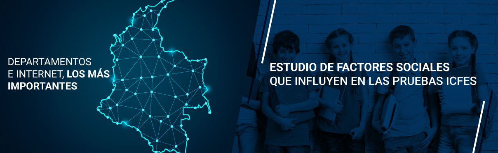

# Proyecto-Icfes-2018

Proyecto enfocado al estudio y la obtención de características sociales más relevantes que afectan el rendimiento en las pruebas Saber 11 del año 2018. Este proyecto incluye múltiples procesos para el pretratamiento de los datos. 
Los datos son proporcionados por la plataforma [Datos Colombia](https://www.datos.gov.co/). Tambien a través del siguiente enlace [Saber 11 2018](https://www.datos.gov.co/Educaci-n/Saber-11-2018-2/m2nt-jw2h) podrá exportar el archivo en formato CSV. 
Enlace video : https://vimeo.com/328628007
## Integrantes del grupo de trabajo:
* Juan David Mantilla 
* Hector Fabian Gonzalez
* Luisa Fernanda Pabon
